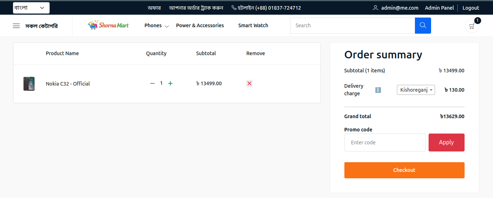
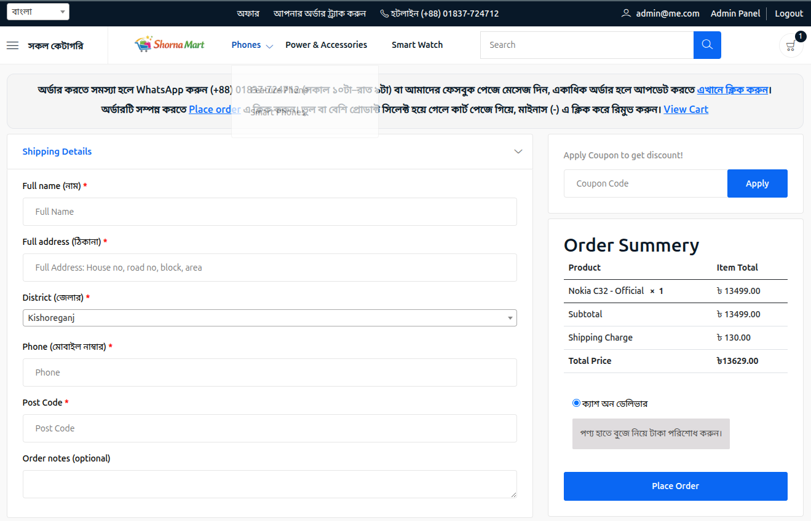
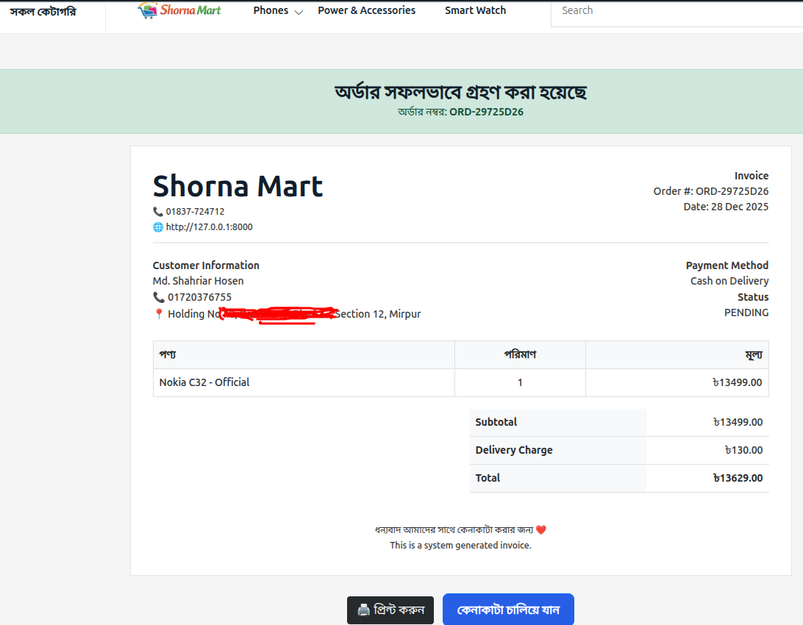
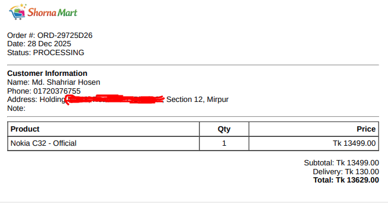

# Emart

E-commerce web application with Python, Django, DRF
Note: Can not use without permission

🚀 Project Features

## 🛍️ Product & Catalog
- Product listing with category-wise browsing
- Product variants support (size, color, price, stock)
- Variant-based pricing and availability
- Featured products & category slider on homepage
- Product image gallery with preview

## 🛒 Cart & Checkout
- Add to cart without login (guest users supported)
- Buy Now (direct checkout) without registration
- Cart auto-updates quantity and price
- Persistent cart using session
- Order summary before checkout

## 📦 Shipping & Pricing
- Shipping cost calculation based on:
- Customer delivery location
- Product weight
- Dynamic total price calculation (product + shipping)
- Multiple shipping zones supported
- Real-time price updates on checkout

## 👤 User Authentication
- User registration and login
- Optional login (guest checkout allowed)
- Secure authentication system
- User dashboard for order tracking

## Order Management
- Order placement without account (guest order)
- Order history for logged-in users
- Order status tracking (Pending, Confirmed, Shipped, Delivered)
- Printable order / invoice
- Admin order management panel

## 🧑‍💼 Admin & Management
- Admin dashboard for managing:
- Products & variants
- Categories
- Orders
- Shipping rules
- Stock management per product variant
- Enable/disable products and categories
- Order invoice generation

## 🔐 Security & Performance
- CSRF protection
- Secure session handling
- Optimized database queries
- Scalable project structure

## 🎨 UI & UX
- Responsive design (Desktop, Tablet, Mobile)
- Clean eCommerce UI
- Category slider & promotional sections
- User-friendly checkout flow

## ⚙️ Tech Stack
- Backend: Python, Django, Django REST Framework
- Frontend: HTML, CSS, JavaScript (Tailwind / Bootstrap)
- Database: PostgreSQL / SQLite
- Authentication: Django Auth
- Deployment Ready (Docker / AWS compatible)

## ✅ Why This Project is Valuable
- Real-world eCommerce workflow
- Supports guest checkout (rare & in-demand)
- Shipping calculation logic (business-ready)
- Product variant system (industry standard)
- Ideal for local jobs, freelancing, and SaaS scaling

<h2>📸 Screenshots</h2>

  
  
  

  
  
  

